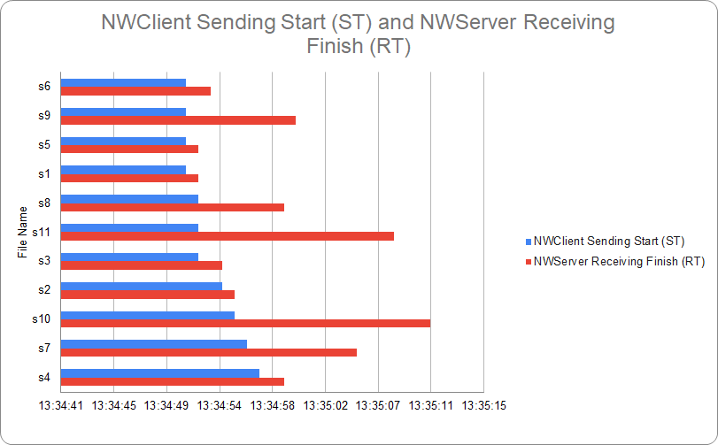
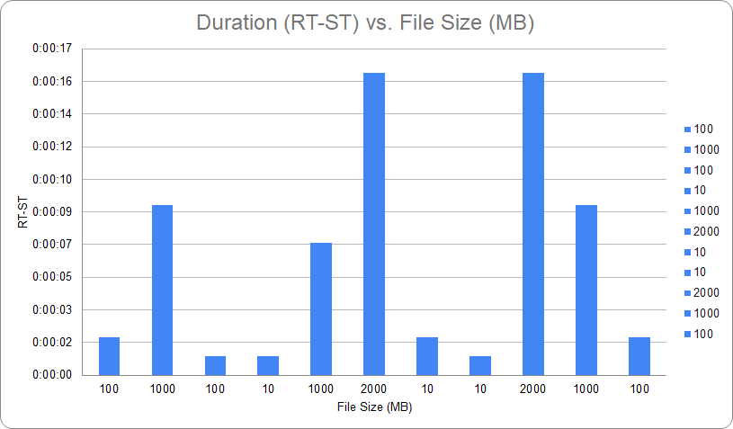

# NWFileTransfer
A Socket based file transfer assignment based on BSD socket.
Development Environment: Ubuntu 18.04

## Requirements: 
1. Send Multiple file concurrently from client to Server 
2. Check Integrity by calculate checksum

## Task List
- [x] Implement NWClient and NWServer and create socket connection.
- [x] Exchange Sample message between client and server.
- [x] Send single text file from client.
- [x] Send multiple text files from client.
- [x] Read all files from client directory /res and send to server
- [x] Limit the receiving file to 10 at server for debug purpose. This will be change later.
- [x] Get Clarfication from Dr. Arslan about TCP checkSum requirements.
- [x] Develop utility functions for calculate checkSum at Client and Server program.
- [x] Write Sample program about pThread to test concurrency.
- [x] Add concurrency using pThread into client and server program.
- [x] Use pack tracer to check concurrency at client and server interface.
- [x] Dynamic concurrency number from user inputs.
- [x] Create a dataset with 100 files and transfer with concurrency 1, 2,4 and 8 and measure throughput. 
- [x] Once the test is done, draw a figure for concurrency value vs throughput.

## Prepare
```c++
$ git pull origin https://github.com/arupcsedu/SocketFileTransfer.git  
$ cd SocketFileTransfer  
```
## Build and Run Server
```c++
$ cd NWServer  
$ g++ NWServer.cpp -o NWServer -pthread
$ ./NWServer  
```
## Build and Run Client
```c++
$ cd ..  
$ cd NWClient   
$ g++ NWClient.cpp -o NWClient -pthread
$ ./NWClient res 127.0.0.1 4

// argv[0] = ./NWClient (Executable)
// argv[1] = res (Input directory)
// argv[2] = 127.0.0.1 (loopback ip address to run in same pc. But it can be replaced by server ip address)
// argv[3] = 4 (Number of files can be sent concurrently)
```
## Performance Analysis





